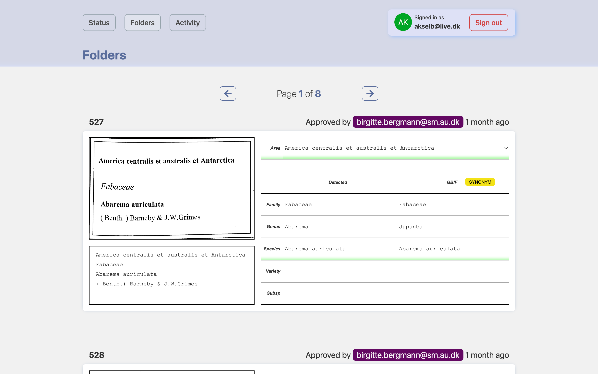

# Species-Web

This full-stack web app is used together with [Species-OCR](https://github.com/NHMDenmark/Species-OCR) for storing the text read from specimen cover labels. The app uses a database to store the text and any match from GBIF that may have been found, along with a history of corrections to the text read. For each cover an image in both color and black/white of the label is stored on disk for easy display in the app.



## Getting started

### 1. Setup Authentication

The app uses authentication provided with [Auth0](https://auth0.com/docs). Setup an Auth0 application and save the Domain, Client ID and Client Secret.

### 2. Configure environment

Copy the .env.local.example file in this directory to .env.local (which will be ignored by Git):

```
cp .env.local.example .env.local
```

Input the values saved in step 1.

Generate values for the secrets. The API_SECRET is the token used by [Species-OCR](https://github.com/NHMDenmark/Species-OCR) for authorizing with the app when uploading data.

### 3. Start the application

To run the app use:

```
docker compose up
```

For development you need to run a database and export the DATABASE_URL environment variable. Then use:

```
npm i
npx prisma migrate deploy
npm run dev
```

## Notes

Authentication is implemented using [AuthJS](https://authjs.dev/), so the provider can easily be substituted for any other supported provider.

**Production**: Depending on the web server used, you may need to allow larger request sizes for the image uploads. For NginX this is done by setting 'client_max_body_size'
